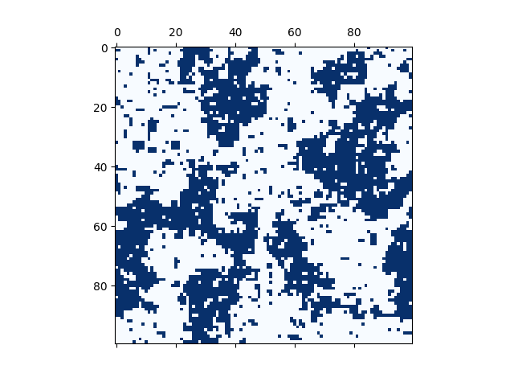

# Ising-Model

This Python code simulates the two-dimensional Ising model using the Metropolis algorithm on a square lattice at a given temperature. 

It begins by initializing the spin grid, in which each magnetic spin is assigned a random initial state of -1 or +1. The Metropolis algorithm then evolves the spin system by randomly flipping spins based on changes in the system's energy, parametrized by $\verb|kBT|$, the Boltzmann constant $k_B$ multiplied by the temperature $T$. The energy calculations take into account the nearest neighbours' spins, which may include diagonal interactions, under periodic boundary conditions. 

After a set number of warm-up sweeps, the magnetization is averaged over further sweeps, and the resulting spin configuration is visualized using a colour map. The average magnetization is also plotted against $\verb|kBT|$ to locate the critical temperature. Setting $\verb|dim = 1|$ runs the one-dimensional model instead, which has no phase transition at any temperature above zero.

The results are displayed in the folders "2D noDiag," "2D withDiag," and "1D."
